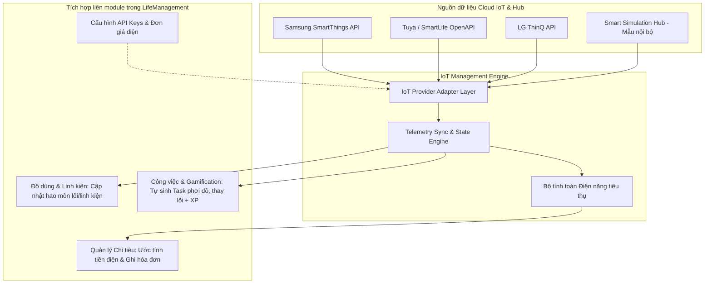

# Kế hoạch phát triển chức năng "Giám sát Nhà thông minh (IoT)"

Tài liệu này vạch ra kiến trúc, luồng dữ liệu và lộ trình triển khai chi tiết cho module **Giám sát Nhà thông minh (IoT)** trong ứng dụng **LifeManagement**, đáp ứng chính xác nhu cầu của gia đình có các thiết bị kết nối Internet: **Máy lọc nước, Máy giặt, Tủ lạnh** và định hướng tích hợp Cloud API các hãng lớn (SmartThings, Tuya, LG ThinQ).

---

## 1. Mục tiêu & Nguyên lý Thiết kế



---

## 2. Mô hình Dữ liệu Mở rộng (`src/types/index.ts`)

Mở rộng kiểu `IoTDevice` và cấu hình trong hệ thống:

```typescript
// Nhà cung cấp IoT được hỗ trợ
export type IoTProviderType = 'smartthings' | 'tuya' | 'lg_thinq' | 'simulation';

// Chi tiết trạng thái thiết bị chuyên biệt
export interface WaterPurifierMetrics {
  tdsInPpm: number;          // TDS nước cấp vào (ví dụ 180 ppm)
  tdsOutPpm: number;         // TDS nước uống tinh khiết (ví dụ 15 ppm - chuẩn QCVN)
  filter1LifePercent: number;// Lõi số 1 (% còn lại)
  filterRoLifePercent: number;// Lõi RO (% còn lại)
  filterMineralPercent: number; // Lõi khoáng (% còn lại)
  isLeaking: boolean;        // Cảnh báo rò rỉ nước
  litersToday: number;       // Số lít nước đã lọc hôm nay
}

export interface WashingMachineMetrics {
  state: 'idle' | 'washing' | 'rinsing' | 'spinning' | 'completed' | 'error';
  remainingMinutes: number;  // Thời gian còn lại
  programName: string;       // vd: "Giặt nhanh 30p", "Giặt đồ cotton"
  doorLocked: boolean;
  drumCleanCycleCount: number; // Số lần giặt kể từ lần vệ sinh lồng trước
}

export interface FridgeMetrics {
  fridgeTemp: number;        // Nhiệt độ ngăn mát (°C, vd: 3)
  freezerTemp: number;       // Nhiệt độ ngăn đông (°C, vd: -18)
  doorAjar: boolean;         // Cảnh báo cửa mở quên (>3-5 phút)
  fastFreezing: boolean;     // Chế độ làm đông nhanh
  ecoMode: boolean;          // Chế độ tiết kiệm điện
}

export interface IoTDeviceExtended {
  id: string;
  name: string;
  type: 'water_purifier' | 'robot_vacuum' | 'fridge' | 'washing_machine' | 'air_conditioner';
  location: string;
  provider: IoTProviderType;
  externalDeviceId?: string; // ID thiết bị trên Cloud của hãng
  linkedAssetId?: string;    // Liên kết với Đồ dùng (Asset) trong nhà
  isOnline: boolean;
  powerUsageKwhToday: number;// Điện năng tiêu thụ hôm nay
  powerUsageKwhMonth: number;// Điện năng tích lũy trong tháng
  currentWattage: number;    // Công suất tức thời (W)
  lastUpdated: string;
  
  // Thông số chuyên biệt theo loại thiết bị
  waterPurifier?: WaterPurifierMetrics;
  washingMachine?: WashingMachineMetrics;
  fridge?: FridgeMetrics;
  
  // Cảnh báo kích hoạt gần nhất
  activeAlerts?: {
    id: string;
    level: 'info' | 'warning' | 'danger';
    message: string;
    timestamp: string;
    actionRequired?: string;
  }[];
}
```

---

## 3. Ba Luồng Tự Động Hóa Cốt Lõi (Cross-Module Automation)

### 3.1. Đồng bộ Tình trạng Linh kiện (`IoT -> Assets`)
* **Thiết bị tiêu biểu:** Máy lọc nước Karofi / Kangaroo.
* **Cơ chế:** Khi chỉ số `filter1LifePercent` hoặc `filterRoLifePercent` giảm xuống dưới 15%, hệ thống:
  1. Đổi trạng thái linh kiện tương ứng trong `AssetComponent` sang cảnh báo (đỏ).
  2. Gợi ý thay mới với chi phí định sẵn trong hồ sơ Đồ dùng.

### 3.2. Tự động sinh Công việc Thông minh (`IoT -> Tasks`)
* **Khi máy giặt giặt xong (`state === 'completed'`):**
  * Tự tạo Task: *"Máy giặt LG đã giặt xong - Lấy đồ đem phơi"* (Thưởng: +10 XP cho thành viên nhận).
* **Khi cửa tủ lạnh mở quá lâu (`doorAjar === true`):**
  * Cảnh báo khẩn trên Dashboard và tạo Task ưu tiên cao: *"Kiểm tra đóng kín cửa tủ lạnh Samsung"*.
* **Khi máy lọc nước cần thay lõi (`filterRoLifePercent <= 5%`):**
  * Tự tạo Task: *"Thay thế lõi lọc RO cho Máy lọc nước"* (Thưởng: +30 XP).

### 3.3. Đo điện năng & Chuyển đổi Hóa đơn (`IoT -> Expenses`)
* Theo dõi tổng `kWh` tiêu thụ của toàn bộ thiết bị hôm nay và trong tháng.
* Nhân với `electricityPricePerKwh` (ví dụ 2.500 VNĐ/kWh) để ra số tiền điện ước tính theo thời gian thực.
* Cung cấp nút tiện ích 1 chạm: **"Ghi nhận tiền điện tháng vào Chi tiêu"**, hệ thống sẽ tự động tạo một khoản `Expense` thuộc danh mục `utilities` (Điện nước) có ghi rõ chi tiết số kWh và thiết bị nào tiêu tốn nhất.

---

## 4. Giao diện Người dùng (UI/UX) Trực quan

```
┌─────────────────────────────────────────────────────────────┐
│ 🏠 GIÁM SÁT NHÀ THÔNG MINH (IoT)               [+ Thêm] [⚙️]│
├─────────────────────────────────────────────────────────────┤
│ ⚡ TỔNG ĐIỆN NĂNG THÁNG NÀY                                 │
│ 142.5 kWh  ~  356.250 ₫                 [Ghi vào Chi tiêu] │
│ 🟢 3/3 Thiết bị Online • Hệ thống cảm biến ổn định          │
├─────────────────────────────────────────────────────────────┤
│ 💧 MÁY LỌC NƯỚC THÔNG MINH (Bếp tầng 1)                     │
│ [SmartThings/Tuya]                                 [Online] │
│ TDS Đầu vào: 195 ppm  |  TDS Đầu ra: 14 ppm (Chuẩn nước sạch)│
│ Lõi 1: [████████░░] 82% | Lõi RO: [██████████] 95%          │
│ Nước lọc hôm nay: 8.5 L | Điện: 0.18 kWh                    │
├─────────────────────────────────────────────────────────────┤
│ ❄️ TỦ LẠNH 2 CÁNH INVERTER (Phòng ăn)                        │
│ [Samsung SmartThings]                               [Online] │
│ Ngăn mát: 3°C | Ngăn đông: -19°C | Cửa: Đóng kín            │
│ Chế độ: Eco tiết kiệm điện | Điện hôm nay: 1.25 kWh         │
├─────────────────────────────────────────────────────────────┤
│ 🧺 MÁY GIẶT CỬA TRƯỚC (Ban công tầng 2)                     │
│ [LG ThinQ]                                          [Online] │
│ Trạng thái: Đang giặt (Chu trình Cotton) - Còn 24 phút     │
│ Tiến độ: [████████████░░░░] 60%                             │
│ Gợi ý: Sắp hoàn tất chu trình, chuẩn bị phơi               │
├─────────────────────────────────────────────────────────────┤
│ ⚠️ CẢNH BÁO THÔNG MINH                                      │
│ • Lõi lọc số 1 dự kiến cần thay sau 25 ngày nữa            │
└─────────────────────────────────────────────────────────────┘
```

---

## 5. Lộ trình Triển khai (Step-by-Step Implementation Plan)

- [ ] **Giai đoạn 1: Nền tảng Model & Store**
  - Mở rộng types trong `src/types/index.ts`.
  - Cập nhật `src/store/useAppStore.ts`: CRUD thiết bị IoT, liên kết Asset, hàm ghi nhận hóa đơn điện sang `addExpense()`, hàm sinh task `addTask()`.
  - Cung cấp sẵn 3 thiết bị thực tế mặc định ban đầu: Tủ lạnh Samsung, Máy giặt LG, Máy lọc nước thông minh Karofi.

- [ ] **Giai đoạn 2: Tầng Kết nối Cloud API & Simulator**
  - Xây dựng module `src/services/iot/`:
    - `types.ts`: Interface chung cho Provider.
    - `smartThingsService.ts`: Kết nối SmartThings REST API qua Personal Access Token.
    - `tuyaService.ts`: Cấu trúc kết nối OpenAPI của Tuya.
    - `simulationService.ts`: Giả lập telemetry sống động theo thời gian thực (đếm ngược máy giặt, dao động TDS, thay đổi nhiệt độ).

- [ ] **Giai đoạn 3: Tái thiết kế Giao diện `IoTTab.tsx` & Components**
  - Card chuyên dụng cho Máy lọc nước (TDS meter, thanh pin lõi lọc).
  - Card chuyên dụng cho Tủ lạnh (Ngăn mát, ngăn đông, cảnh báo cửa).
  - Card chuyên dụng cho Máy giặt (Đếm ngược thời gian, tiến trình chu trình, trạng thái cửa).
  - Modal Thêm mới thiết bị & Modal Cấu hình Cloud API / Đơn giá điện.
  - Tích hợp các nút 1-chạm (Ghi hóa đơn điện, Nhận việc phơi đồ / thay lõi).

- [ ] **Giai đoạn 4: Đa ngôn ngữ (i18n) & Kiểm thử hoàn thiện**
  - Bổ sung translation keys cho `vi.ts`, `en.ts`, `ja.ts`.
  - Kiểm tra tương thích Dark Theme & Light Theme, mobile layout.
  - Build test kiểm tra `npm run build`.
